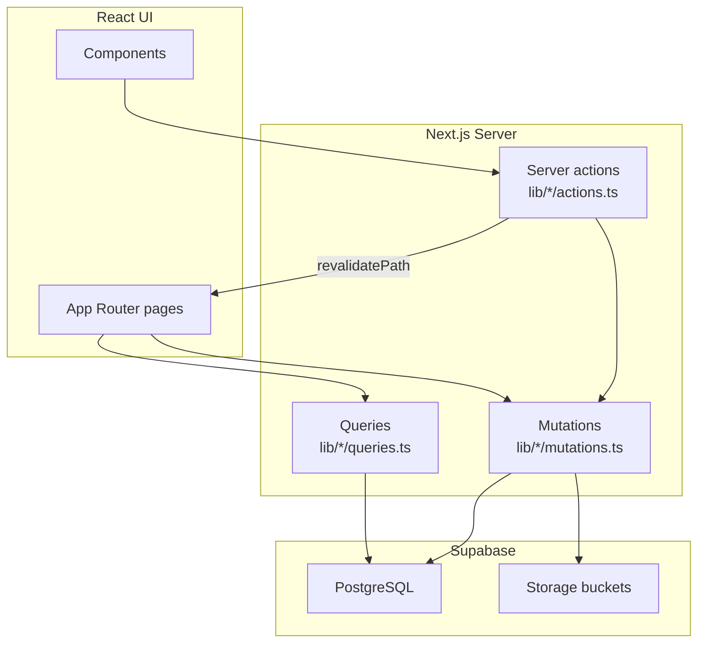
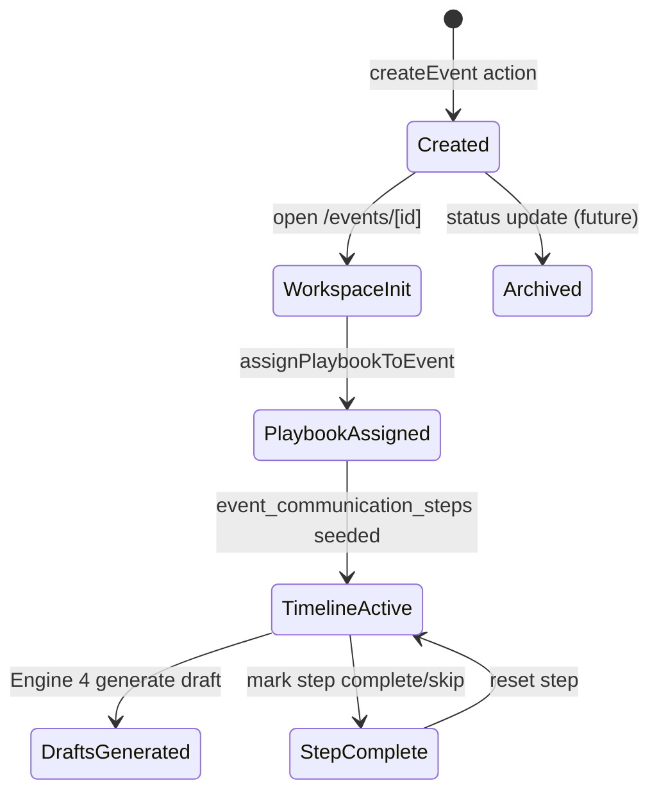
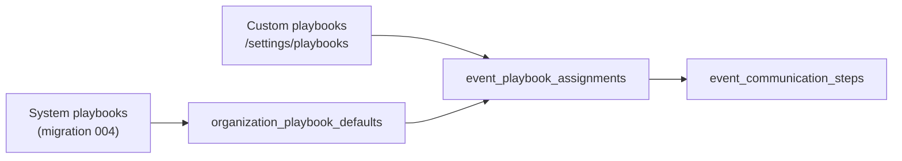
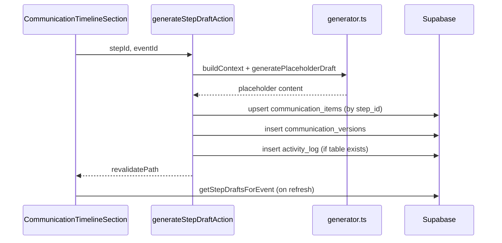
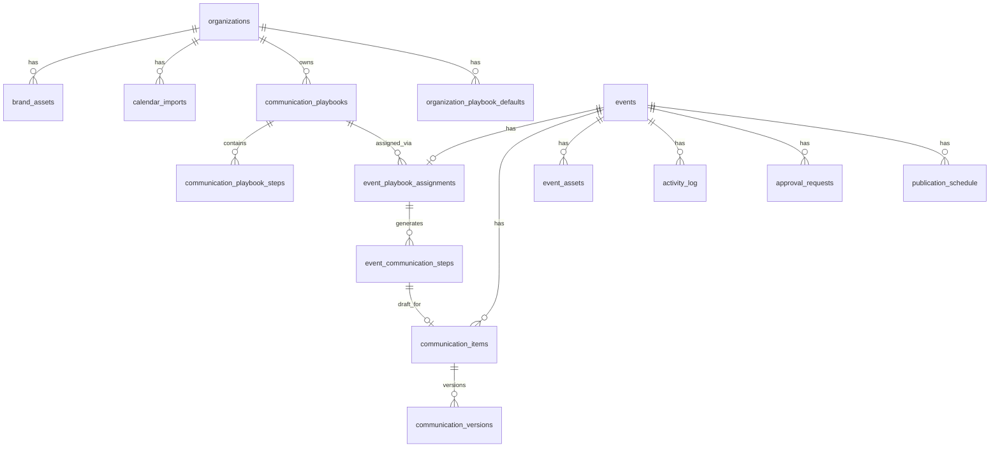

# CampaignOS — Architecture

**Release:** 0.5  
**Stack:** Next.js 15 (App Router) · React 19 · Supabase (PostgreSQL + Storage) · Tailwind CSS 4  
**Last updated:** June 2026

This document describes how CampaignOS is structured at Release 0.5 — after Engine 4 verification, documentation-only.

---

## Folder structure

```
CampaignOS/
├── docs/                          # Product & engineering documentation
├── scripts/
│   ├── clean.sh                   # Remove .next cache
│   └── verify.sh                  # Route + CSS health check
├── supabase/
│   └── migrations/                # Ordered SQL migrations (001–006)
├── src/
│   ├── app/                       # Next.js App Router pages
│   │   ├── layout.tsx             # Root layout
│   │   ├── page.tsx               # → redirect /dashboard
│   │   └── (dashboard)/           # Authenticated-style shell routes
│   │       ├── layout.tsx         # DashboardShell wrapper
│   │       ├── dashboard/
│   │       ├── events/            # List, create, [id] workspace
│   │       ├── school-setup/
│   │       ├── calendar/review/
│   │       └── settings/playbooks/
│   ├── components/
│   │   ├── calendar-review/       # Calendar Import Review UI
│   │   ├── communications-brain/  # Engine 4 draft UI
│   │   ├── event-workspace/       # Sprint 5 workspace sections
│   │   ├── events/                # Event list, create, cards
│   │   ├── layout/                # Sidebar, DashboardShell
│   │   ├── playbooks/             # Engine 3 playbook UI
│   │   ├── school-setup/          # Onboarding wizard
│   │   └── ui/                    # Shared primitives (Button, Card, …)
│   ├── lib/                       # Server-side domain logic
│   │   ├── calendar/              # Sample calendar review data
│   │   ├── communications-brain/  # Engine 4 generator, mutations, queries, actions
│   │   ├── event-workspace/       # Workspace init, hub, assets, timeline
│   │   ├── events/                # Event CRUD
│   │   ├── organizations/         # School setup CRUD
│   │   ├── playbooks/             # Engine 3 playbooks, health, assignment
│   │   ├── supabase/              # client, server, middleware helpers
│   │   └── utils/                 # cn, date formatting
│   ├── types/                     # Shared TypeScript types
│   └── middleware.ts              # Supabase session refresh
└── product-v2/                    # Product blueprint (separate from app code)
```

**Convention:** Pages are thin — they fetch via `lib/*/queries.ts`, call `initialize*` mutations where needed, and pass props to components. User interactions invoke `lib/*/actions.ts` server actions.

---

## Data flow



1. **Read path:** Server Component page → `queries.ts` → Supabase `select` → mappers → props to client/server components.
2. **Write path:** Client component → server action → `mutations.ts` → Supabase `insert/update` → `revalidatePath` → page re-renders with fresh data.
3. **Fallback path:** If queries return empty (missing migration / no rows), pages use `mock-data.ts` builders so the UI remains usable.

---

## Dependency graph (domain layers)

```
School Setup
    ↓
Calendar
    ↓
Events
    ↓
Playbooks
    ↓
Timeline
    ↓
Communication Items
    ↓
Communication Versions
```

| Layer | Tables / artifacts | Depends on |
|-------|-------------------|------------|
| School Setup | `organizations`, `brand_assets`, storage uploads | — |
| Calendar | `calendar_imports`, review UI sample data | Organization |
| Events | `events` | Organization (optional in MVP) |
| Playbooks | `communication_playbooks`, `communication_playbook_steps`, `event_playbook_assignments` | Events, Organizations |
| Timeline | `event_communication_steps` | Playbook assignment |
| Communication Items | `communication_items` (hub + step-linked) | Events, Timeline steps |
| Communication Versions | `communication_versions` | Communication Items |

---

## Event lifecycle



**Create (`lib/events/actions.ts`):**

1. Validate input → insert `events` row.
2. Resolve organization → auto-assign default playbook by `event_type`.

**Open workspace (`app/(dashboard)/events/[id]/page.tsx`):**

1. Load event; 404 if missing.
2. `initializeEventWorkspace(event)` — seeds hub communication items, assets, activity log when migration 003 tables exist and no comm items yet; assigns playbook if none.
3. Parallel fetch: workspace bundle, playbook data, available playbooks, step drafts.

**Status values:** `draft` → `scheduled` → `published` → `archived` (schema in 001; full lifecycle UI partial).

---

## Playbook lifecycle



**System playbooks:** Seeded in migration 004 (Book Fair, Teacher Appreciation, etc.) with `communication_playbook_steps` template rows.

**Organization defaults:** Created when school setup completes (`seedOrganizationPlaybookDefaults`).

**Assignment (`lib/playbooks/mutations.ts` → `assignPlaybookToEvent`):**

1. Upsert `event_playbook_assignments` (one per event).
2. Copy playbook steps → `event_communication_steps` with computed `due_date` from event date + `relative_day`.
3. Delete prior steps on reassignment.

**Step status:** `upcoming` → `completed` | `skipped` (actions in `lib/playbooks/actions.ts`).

**Communication Health:** Calculated in `lib/playbooks/health.ts` from required step completion ratio.

---

## Draft lifecycle (Engine 4)



**Generate Draft (`lib/communications-brain/mutations.ts`):**

1. Load event, playbook steps, organization name.
2. `generatePlaceholderDraft()` — channel-aware template string.
3. Upsert `communication_items` where `event_communication_step_id = stepId`.
4. Append new `communication_versions` row (increment `version_number`).
5. Regenerate creates v2+ on same item.

**Edit draft:** `updateStepDraftAction` → new version row, item status stays `draft`.

**Two item types in `communication_items`:**

| Type | `event_communication_step_id` | Unique constraint |
|------|------------------------------|-------------------|
| Hub channel item | `NULL` | One per `(event_id, channel)` |
| Timeline draft | Set to step UUID | One per step |

---

## Database relationships



### Migration reference

| File | Creates / alters |
|------|------------------|
| `001_create_events_table.sql` | `events` |
| `002_create_school_setup_tables.sql` | `organizations`, `brand_assets`, `calendar_imports`, storage buckets |
| `003_create_event_workspace_tables.sql` | Extends `events`; `event_assets`, `communication_items`, `communication_versions`, `approval_requests`, `publication_schedule`, `activity_log` |
| `004_create_communication_playbook_tables.sql` | `events.event_type`; playbook tables; seeds system playbooks |
| `005_link_communication_items_to_playbook_steps.sql` | `communication_items.event_communication_step_id`, partial unique indexes |
| `006_create_communication_draft_tables.sql` | Idempotent repair: comm tables + Engine 4 indexes (skip 005 if 006 applied) |

---

## Server actions

All action files use `"use server"` and must export **async functions only** (no runtime object exports).

### `lib/organizations/actions.ts`

| Action | Purpose |
|--------|---------|
| `completeSchoolSetup` | Save org profile, brand assets, seed playbook defaults |

### `lib/events/actions.ts`

| Action | Purpose |
|--------|---------|
| `createEvent` | Insert event + auto-assign playbook |

### `lib/event-workspace/actions.ts`

| Action | Purpose |
|--------|---------|
| `ensureEventWorkspaceAction` | Init workspace (unused in UI; page calls mutation directly) |
| `updateEventOverviewAction` | Save overview fields |
| `generateCommunicationAction` | Hub channel placeholder generate |
| `approveCommunicationAction` | Hub approve (placeholder) |
| `publishCommunicationAction` | Mark hub item published |
| `uploadAssetPlaceholderAction` | Asset filename placeholder |

### `lib/playbooks/actions.ts`

| Action | Purpose |
|--------|---------|
| `createPlaybookAction` | New custom playbook |
| `updatePlaybookAction` | Edit playbook + steps |
| `duplicatePlaybookAction` | Clone playbook |
| `archivePlaybookAction` | Soft archive |
| `assignPlaybookToEventAction` | Assign / reassign playbook |
| `completeCommunicationStepAction` | Mark timeline step complete |
| `skipCommunicationStepAction` | Skip optional step |
| `resetCommunicationStepAction` | Reset step to upcoming |
| `ensureEventHasPlaybookAction` | Ensure assignment exists |
| `getPlaybookEditorData` | Load editor form data |

### `lib/communications-brain/actions.ts`

| Action | Purpose |
|--------|---------|
| `generateStepDraftAction` | Generate draft for one timeline step |
| `generateAllDraftsAction` | Generate drafts for all steps |
| `updateStepDraftAction` | Save edited draft (new version) |

---

## Supabase storage

Configured in migration **002**:

| Bucket | Public | Used by |
|--------|--------|---------|
| `school-assets` | Yes | School Setup — PTO logo, school logo |
| `calendar-uploads` | Yes | School Setup — calendar file upload |

**Path pattern:** `{organization_id}/{filename}`

**RLS:** Open insert/select for anon and authenticated (MVP).

**Not yet used:** Event creative assets (`event_assets.storage_path`) — uploads are filename placeholders only.

**Client helper:** `lib/supabase/server.ts` (SSR cookie client) is used by all mutations/queries. `lib/supabase/client.ts` exists for future browser-side access but has no imports at Release 0.5.

---

## AI integration points (future)

Engine 4 is designed as a swap-in layer. Integration points:

| Location | Current | Future |
|----------|---------|--------|
| `lib/communications-brain/generator.ts` | `generatePlaceholderDraft()` | Call OpenAI with event + org + step context |
| `lib/event-workspace/mutations.ts` → `generateCommunicationContent` | Static placeholder | AI-generated hub channel copy |
| `lib/event-workspace/constants.ts` → `PLACEHOLDER_COMMUNICATION_CONTENT` | Hard-coded strings | Prompt templates / few-shot examples |
| `organizations` tone, hashtags, mission | Stored in DB | Injected into system prompts |
| `event_assets.ai_generated` | Column exists | Flag AI-produced artwork |
| Draft Preview Panel — Approve button | Disabled placeholder | Trigger `approval_requests` workflow |
| `publication_schedule` table | Schema only | Connect to Meta, email, website CMS |

**Recommended swap pattern:**

```typescript
// generator.ts — future
export async function generateDraft(context: DraftGenerationContext): Promise<string> {
  if (process.env.OPENAI_API_KEY) {
    return generateWithOpenAI(context);
  }
  return generatePlaceholderDraft(context);
}
```

---

## Component map (Event Workspace)

The primary integration surface is `/events/[id]`:

| Component | Domain |
|-----------|--------|
| `EventWorkspaceHero` | Hero + Generate All Drafts |
| `AssignedPlaybookSection` | Playbook assignment |
| `CommunicationHealthSection` | Health ring |
| `CommunicationTimelineSection` | Timeline steps + Generate Draft + preview |
| `UpcomingCommunicationsSection` | Next steps list |
| `EventOverviewSection` | Editable event fields |
| `CommunicationsHubSection` | Nine channel hub cards |
| `CreativeAssetsSection` | Asset placeholders |
| `TimelineSection` | Activity log display |
| `DraftPreviewPanel` | Engine 4 draft preview/edit |
| `GenerateAllDraftsButton` | Engine 4 bulk generate |

---

## Codebase audit summary

Documented in `docs/RELEASE_0_5.md`:

- **Duplicate components:** None (distinct filenames; no redundant copies).
- **Unused lib files:** `supabase/client.ts` unused; two unused exported functions noted.
- **Migrations:** All six files documented in this architecture note and Release 0.5.
