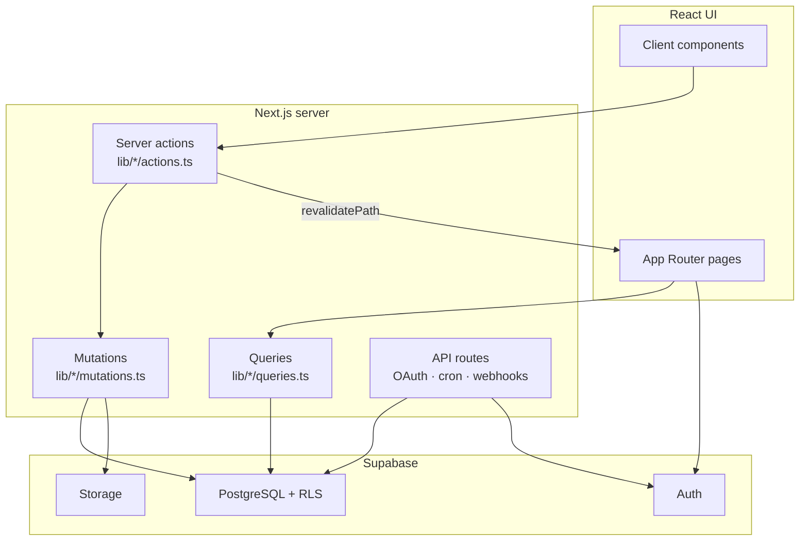
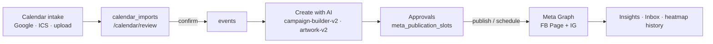

# Hey Ralli — Architecture

**Status:** Living  
**Owner:** Engineering  
**Product brand:** Hey Ralli (repo / Vercel project may still say CampaignOS)  
**Production:** [heyralli.com](https://heyralli.com)  
**Stack:** Next.js 15 (App Router) · React 19 · TypeScript · Supabase · Tailwind CSS 4 · Vercel  
**Last updated:** July 21, 2026  

This document describes how the application is structured today. For a QA-oriented overview (workflow, limitations, test focus), see [QA architecture overview](../qa/architecture-overview.md). For Ask Ralli routing, sources, and the QA matrix, see [Ask Ralli Assistant](./ask-ralli-assistant.md). For feature status, see [feature list](../product/feature-list.md).

---

## 1. What the product is

Hey Ralli is a calendar-first AI communications OS for school PTO / PTA volunteers: import school dates, turn them into events, generate artwork and captions with AI, approve, and publish or schedule to Facebook / Instagram. Surrounding surfaces include Today dashboard, Tasks, Meta Inbox, Insights, Files, Vendors, and team access control.

---

## 2. Tech stack

| Layer | Choice |
|-------|--------|
| Framework | Next.js 15 App Router, React 19, TypeScript |
| UI | Tailwind CSS 4, shared `src/components/ui` |
| Auth / DB / Storage | Supabase (Auth, PostgreSQL + RLS, Storage) |
| Hosting | Vercel (Production + Preview; Cron) |
| AI text | OpenAI Chat Completions (`OPENAI_API_KEY`) via `src/lib/ai` |
| AI images | OpenAI Images via `src/lib/ai-artwork` / `artwork-v2` |
| Social | Meta Graph API (`src/lib/meta-publishing`, `inbox`, `insights`) |
| Calendar OAuth | Google Calendar API (`src/lib/google-calendar`) |
| Email | Resend |
| Monitoring | Sentry |
| Optional | Canva OAuth, Monday.com OAuth |
| E2E | Playwright (`tests/hey-ralli/smoke/`) |

**Convention:** Pages stay thin. Reads go through `src/lib/*/queries.ts`; writes through `actions.ts` → `mutations.ts`; domain types live under `src/types` or colocated lib types.

---

## 3. Repository layout (current)

```
CampignOS/
├── docs/                         # Docs hub (see docs/README.md)
│   └── product/blueprints/       # Product design blueprints (not runtime)
├── scripts/                      # dev, verify, hey-ralli-test, capture helpers
├── supabase/migrations/          # Ordered SQL (001…069+, access-template migrations)
├── tests/hey-ralli/              # Playwright smoke
└── src/
    ├── app/                      # App Router
    │   ├── (dashboard)/          # Authenticated product shell
    │   ├── api/                  # OAuth callbacks, cron, webhooks, insights sync/export
    │   ├── auth/                 # Auth callback / signout
    │   ├── features/             # Marketing feature explorer
    │   ├── invite/               # Invite accept
    │   └── login/
    ├── components/               # UI by domain (unified-calendar, artwork-v2, tasks-v2, …)
    ├── lib/                      # Server domain logic (see §5)
    ├── types/
    └── middleware.ts             # Session refresh + public route allowlist
```

**Primary nav routes:** `/dashboard`, `/calendar`, `/events`, `/create-with-ai`, `/approvals`, `/tasks`, `/inbox` (Communications Hub), `/files`, `/vendors`, `/insights`, plus Settings subtree.

---

## 4. Request and data flow



1. **Read:** Server Component → `queries.ts` → Supabase (user session) → mappers → props.  
2. **Write:** Client → server action → `mutations.ts` → insert/update → `revalidatePath`.  
3. **Background:** Vercel Cron → `/api/cron/*` (often uses service-role admin client).  
4. **OAuth:** Browser → `/api/{provider}/oauth/start` → provider → `/api/{provider}/oauth/callback` → org connection row.

Multi-tenant rule: almost all rows are **organization-scoped**. Membership + RLS (migrations 064–067+) enforce access; app code also resolves active org via membership helpers.

---

## 5. Domain architecture

### 5.1 Primary product path



| Stage | Key modules | Persistence |
|-------|-------------|-------------|
| Calendar intake | `calendar-import`, `google-calendar`, school-year subscribe feeds | `calendar_imports`, `organization_google_calendar_connections`, `school_years.calendar_subscribe_url` — dedupe: [calendar-import-dedupe.md](../qa/calendar-import-dedupe.md) |
| Events / year calendar | `events`, `communications-calendar`, `unified-calendar` UI | `events`, publication slots on calendar |
| Campaign AI | `campaign-builder-v2`, `ai`, `ai-artwork`, `artwork-v2`, `meta-captions` | Creative assets in Storage; campaign/milestone state in DB |
| Approvals & publish | `approvals-scheduling`, `meta-publishing` | Approval items + `meta_publication_slots` — native schedule + Calendar DnD: [meta-calendar-dnd.md](../qa/meta-calendar-dnd.md) |
| Inbox / Insights | `inbox`, `insights`, `meta` | Synced Meta entities + analytics tables |
| Access | `auth`, `access-templates`, `organization-workspace` | Memberships, templates, roster |
| Tasks | `tasks-v2`, `task-hub` | Task rows (assignee_user_id, event scope) |

### 5.2 Major `src/lib` domains (non-exhaustive)

| Area | Packages |
|------|----------|
| Auth / tenancy | `auth`, `organizations`, `organization-workspace`, `access-templates`, `school-years` |
| Calendar | `calendar-import`, `google-calendar`, `communications-calendar`, `posting-analytics` |
| Events / campaigns | `events`, `events-phase3`, `event-workspace`, `campaign-builder-v2`, `playbooks` |
| Creative | `ai`, `ai-artwork`, `artwork-v2`, `creative-assets`, `canva` |
| Meta | `meta-publishing`, `meta-captions`, `inbox`, `insights`, `meta` |
| Work management | `tasks-v2`, `approvals-scheduling`, `vendors`, `campaign-files` |
| Integrations helpers | `integrations` (shared OAuth CTA / returnTo) |
| Shell / marketing | `today`, `settings-v2`, `marketing`, `ralli-assistant` |

Legacy Engine 4 / `communications-brain` placeholder-draft paths still exist in the tree; **product primary path** for social creative is Create with AI → Approvals → Meta, not the old timeline placeholder generator.

### 5.3 Event workspace

`/events/[id]` is the event home (tabs: Approvals, Tasks, Create with AI [handoff], Volunteers, Responsibilities, Notes, Files, Vendors, Activity; default Approvals). Phase 3 workspace is default; older planning-hub UI is fallback / partial.

Playbooks still seed milestone timelines and health; campaign creative generation is centered on **Create with AI** (`/create-with-ai` and event campaign builder).

---

## 6. Integrations

| Provider | Connect surface | Storage | Docs |
|----------|-----------------|---------|------|
| Meta | `/settings/meta` (+ Inbox / Insights CTAs) | `organization_meta_connections` | [meta.md](../integrations/meta.md) |
| Google Calendar | Connect: `/settings/integrations/calendar`; import/review: `/calendar/import` → `/calendar/review` | `organization_google_calendar_connections` | [google-calendar.md](../integrations/google-calendar.md) |
| Canva | `/settings/canva` | `organization_canva_connections` | — |
| Monday | `/settings/monday` | `organization_monday_connections` | — |

Shared helpers: `src/lib/integrations/oauth.ts` (`buildOAuthStartPath`, `safeOAuthReturnTo`).

**Cron (see `vercel.json`):** ICS subscribe sync, Google Calendar sync, Meta publish, Meta token health, inbox sync, story / manual-upload reminder emails.

---

## 7. AI integration (live)

AI is **shipped**, not a future stub.

| Capability | Entry | Provider |
|------------|-------|----------|
| Captions / campaign copy | `campaign-builder-v2`, `meta-captions` | OpenAI chat |
| Artwork feed + story | `ai-artwork`, `artwork-v2` | OpenAI Images |
| Calendar parse / AI fix | `calendar-import` | OpenAI chat |
| Inbox reply drafts | `inbox` | OpenAI chat |
| Ask Ralli | `ralli-assistant` | OpenAI chat (+ deterministic packs when AI off) — detail: [ask-ralli-assistant.md](./ask-ralli-assistant.md) |
| Org tone | AI Brain settings → prompt grounding | DB prefs |

Pattern: `isAiConfigured()` / missing `OPENAI_API_KEY` → clear “not configured” behavior rather than silent success.

**Product rule:** AI drafts; humans approve and publish. No silent auto-publish of campaign creative.

---

## 8. Database and storage (orientation)

- Migrations live in `supabase/migrations/` (well past the original 001–006 set; includes Meta, Insights, vendors, team access RLS, Google Calendar connections, access templates, etc.).
- **RLS:** Membership-scoped policies are the default for tenant tables; Storage membership RLS in later migrations. Cron / admin paths use `createAdminClient()` where required.
- **Storage buckets (examples):** school logos / brand assets, calendar uploads, artwork / creative assets. Prefer org-prefixed paths.

For deeper schema notes see archived [DATABASE_BLUEPRINT.md](../archive/DATABASE_BLUEPRINT.md) and [storage-rls.md](./storage-rls.md) (may lag newest migrations — prefer live migrations + [feature list](../product/feature-list.md) for product truth).

---

## 9. Auth and access control

- Supabase Auth session refreshed in middleware.  
- Organization memberships + **access templates** (permission toggles) + built-in role presets.  
- Effective access gates artwork, approve, publish, people, integrations, and event visibility (`canAccessEvent` / see-vs-work modes).  
- Invites: `/invite/[token]`; founding access codes for sign-up.  
- Detail: [access-control.md](./access-control.md).

---

## 10. Testing

| Kind | How |
|------|-----|
| Unit / domain | `npm run test:*` scripts in `package.json` (e.g. insights, team-access, approvals) |
| Smoke E2E | `npm run test:hey-ralli` → Playwright under `tests/hey-ralli/smoke/` |
| Manual QA map | [qa/architecture-overview.md](../qa/architecture-overview.md) |

---

## 11. Known gaps (architecture-relevant)

Do not treat these as regressions unless a ticket says otherwise. Full list: [feature-list.md](../product/feature-list.md) appendix.

- Stripe / paid plan enforcement — deferred  
- Gmail Connect / Gmail inbox — deferred  
- Create-with-AI → Meta published-state sync step — stub / incomplete  
- Insights-weighted heatmap — deferred (current heatmap = prefs + publish history when Meta connected)  
- Tasks Calendar / Timeline / Workload — deferred (hidden)  
- Shared connection-health framework — partial  
- Vendor payments/contracts depth — partial shells  
- AI credits widget — stub UI  

Historical Release 0.5 notes remain in [archive/RELEASE_0_5.md](../archive/RELEASE_0_5.md) and [archive/SPRINTS.md](../archive/SPRINTS.md); they describe earlier Engine milestones and should not be read as current architecture.

---

## 12. Doc map

| Doc | Use |
|-----|-----|
| [qa/architecture-overview.md](../qa/architecture-overview.md) | QA onboarding: workflow, diagrams, limitations |
| [product/feature-list.md](../product/feature-list.md) | Shipped / partial / deferred inventory |
| [integrations/meta.md](../integrations/meta.md) | Meta OAuth model |
| [integrations/google-calendar.md](../integrations/google-calendar.md) | Google Calendar OAuth + sync |
| [qa/meta-calendar-dnd.md](../qa/meta-calendar-dnd.md) | Meta-native Graph schedule + Calendar DnD (no re-approval) |
| [qa/calendar-import-dedupe.md](../qa/calendar-import-dedupe.md) | School-event import identity / Update vs Duplicate |
| [access-control.md](./access-control.md) | Membership + permissions |
| [product/vision.md](../product/vision.md) · [blueprints](../product/blueprints/) | Product intent |

---

**Canonical docs:** [Documentation home](../README.md) · [Feature list](../product/feature-list.md) · [QA overview](../qa/architecture-overview.md)
