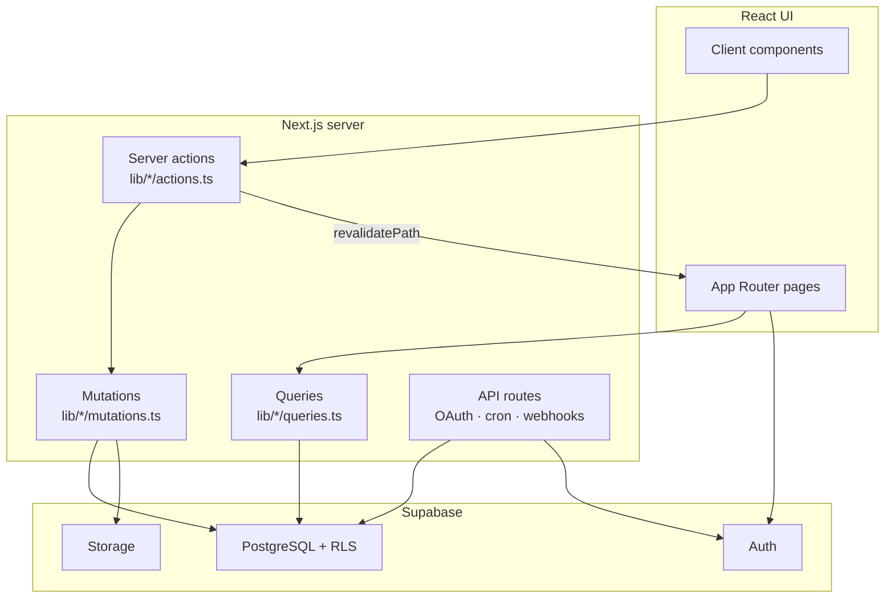
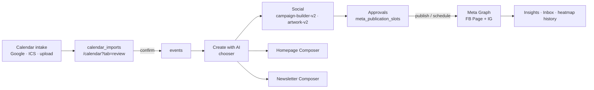

# Hey Ralli — Architecture

**Status:** Living  
**Owner:** Engineering  
**Product brand:** Hey Ralli (repo / Vercel project may still say CampaignOS)  
**Production:** [heyralli.com](https://heyralli.com)  
**Stack:** Next.js 15 (App Router) · React 19 · TypeScript · Supabase · Tailwind CSS 4 · Vercel · Stripe  
**Last updated:** August 18, 2026 — Resources Featured Tutorials include Create a flyer  
**Related:** [Feature list](../product/feature-list.md) · [Image architecture](./image-architecture.md) · [Storage RLS](./storage-rls.md) · [Access control](./access-control.md) · [Billing & access](../ops/billing-and-access.md) · [Stripe integration](./stripe-integration.md) · [QA architecture overview](../qa/architecture-overview.md) · [Launch checklist](../qa/launch-checklist.md) · [Ask Ralli Assistant](./ask-ralli-assistant.md) · [Release checkpoint 2026-08-08](../qa/release-checkpoint-2026-08-08-events-workspace.md)

This document describes how the application is structured today. For a QA-oriented overview (workflow, limitations, test focus), see [QA architecture overview](../qa/architecture-overview.md). For Ask Ralli routing, sources, and the QA matrix, see [Ask Ralli Assistant](./ask-ralli-assistant.md). For feature status, see [feature list](../product/feature-list.md).

---

## 1. What the product is

Hey Ralli is a calendar-first AI communications OS for school PTO / PTA volunteers: value-first onboarding (first event, then skippable calendar / brand / team / Meta), import school dates, generate creative with AI (social campaigns, homepage toolkit, newsletter), approve, and publish or schedule to Facebook / Instagram. Surrounding surfaces include Today dashboard, Volunteers Master, Tasks, Meta Inbox, Insights, Files, Vendors, team access control, and Stripe-backed AI credits / plans.

Public marketing (WOW homepage, pricing, features, auth chrome) sits outside the dashboard shell. HTML mockups and demo videos under `public/` are design references — not product UI until intentionally wired.

---

## 2. Tech stack

| Layer | Choice |
|-------|--------|
| Framework | Next.js 15 App Router, React 19, TypeScript |
| UI | Tailwind CSS 4, shared `src/components/ui`; Ease shells (cream / Fraunces) on major hubs |
| Auth / DB / Storage | Supabase (Auth, PostgreSQL + RLS, Storage) |
| Hosting | Vercel (Production + Preview; Cron) |
| Billing | Stripe Checkout / Customer Portal / webhooks (`src/lib/billing`) — [stripe-integration.md](./stripe-integration.md) |
| AI text | OpenAI Chat Completions (`OPENAI_API_KEY`) via `src/lib/ai` (+ credit metering) |
| AI images | OpenAI Images via `src/lib/ai-artwork` / `artwork-v2` — display/storage rules: [image-architecture.md](./image-architecture.md) |
| Social | Meta Graph API (`src/lib/meta-publishing`, `inbox`, `insights`) |
| Calendar OAuth | Google Calendar API (`src/lib/google-calendar`) |
| Email | Resend |
| Monitoring | Sentry |
| Optional | Canva OAuth, Monday.com OAuth, GIPHY (inbox GIFs) |
| E2E | Playwright (`tests/hey-ralli/smoke/`) |

**Convention:** Pages stay thin. Reads go through `src/lib/*/queries.ts`; writes through `actions.ts` → `mutations.ts`; domain types live under `src/types` or colocated lib types.

---

## 3. Repository layout (current)

```
CampignOS/
├── docs/                         # Docs hub (see docs/README.md)
│   └── product/blueprints/       # Product design blueprints (not runtime)
├── public/                       # Static: marketing mockups (*.html), demos (*.webm)
├── scripts/                      # dev, verify, hey-ralli-test, capture helpers
├── supabase/migrations/          # Ordered SQL (001… + dated; access / storage / billing)
├── tests/hey-ralli/              # Playwright smoke
└── src/
    ├── app/                      # App Router
    │   ├── (dashboard)/          # Authenticated product shell
    │   ├── account/              # Agreements, change password
    │   ├── api/                  # OAuth callbacks, cron, webhooks, insights, billing
    │   ├── auth/                 # Auth callback / signout
    │   ├── billing/              # Canceled-subscription lockout
    │   ├── features/             # Marketing feature explorer (+ motion demos)
    │   ├── invite/               # Invite accept (+ tokenless guidance)
    │   ├── login/ · signup/ · forgot-password/
    │   └── page.tsx              # Marketing WOW homepage
    ├── components/               # UI by domain (*EaseShell, marketing-wow, …)
    ├── marketing/                # Isolated marketing motion engine + demos
    │   ├── engine/               # Shared timeline / primitives (Motion for React)
    │   ├── demo-generator/       # Cursor DemoSpec contract + private demo registry
    │   └── demos/                # Lazy-loaded marketing demos (harness-private until wired)
    ├── lib/                      # Server domain logic (see §5)
    ├── types/
    └── middleware.ts             # Primary-domain redirect + session / gates
```

**Marketing motion engine:** reusable demo animation system at `src/marketing/engine`. Independent from dashboard, Supabase, and live Studio marketing pages (`src/components/marketing`). Dev harness: `/dev/motion-engine` (404 in production).

**Marketing demo generator:** authoring contract at `src/marketing/demo-generator` — typed `DemoSpec`, validation, and private `demoRegistry`. Demos stay harness-private until intentionally integrated.

**Marketing WOW (shipped public funnel):** live React surfaces under `src/components/marketing-wow` + `src/lib/marketing-wow` — cinematic home (`/`), auth/legal chrome, floating bottom nav, cookie consent. Feature explorer at `/features` documents Create with AI modules (Home Page · Social · Newsletter) plus Screen Studio product demos (`PUBLIC_FEATURES_IN_ACTION_STORIES`); Communications Hub and Ask Ralli Motion demos stay harness-private (`/dev/motion-engine`) until narrated videos exist. Resources (`/resources`) Featured Tutorials are narrated MP4s (`src/lib/marketing/resource-tutorials.ts`, assets under `public/videos/resources/` + `public/images/resources/tutorials/`, lightbox with native controls — user-initiated, not homepage silent autoplay; shipped: `create-an-event`, `create-with-ai`, `create-a-flyer`, `approvals-scheduling`). Browse by Topic does not link Communications Hub or Ask Ralli until those videos ship. Marketing header hides the top links below `md` and opens the same destinations (Why Hey Ralli · Pricing · Resources · About) from a hamburger menu; the footer also links Resources. Homepage Product Tour uses mobile video chips. Product/calendar cinematic HTML mockups + `public/demos/calendar-demo.webm` exist as assets; a “Watch product demo” CTA on live `/` stays **in progress** until GO (see feature list).

**Primary product nav:** `/dashboard`, `/calendar`, `/events`, `/volunteers`, `/create-with-ai` (chooser), `/approvals`, `/tasks`, `/communications` (Communications Hub / inbox), `/files`, `/vendors`, `/insights`, plus Settings Ease subtree. **Top rail:** Home · Ask Ralli (**?**) · Settings. Help Center at `/help` (browse from Ask Ralli dialog). Ask Ralli is not sidebar-pinned.

**Create with AI routes (not separate sidebar items for composers):**

| Route | Role |
|-------|------|
| `/create-with-ai` | Chooser: Home Page · Social Media · Newsletter · Flyer |
| `/create-with-ai/social` | Campaign Builder v2 (Creative Setup → Review & Approve) |
| `/create-with-ai/flyer` | React Flyer builder (`FlyerBuilderShell`); creates/loads durable `flyers` drafts (`?flyerId=` / `?eventId=`); generate via `/api/flyer-composer/generate`; linking an event attaches that event’s Social campaign Event Image / first feed post (`campaign_builder_sessions`) as inspiration (then event-workspace hero / approved square) unless a volunteer already uploaded or picked a gallery image; Approvals via `/api/flyer-composer/send-for-approval` |
| `/flyers` | Flyer library (grid + status filters); cards deep-link to builder / `/flyers/[id]/review` / `/flyers/[id]/changes` |
| `/homepage-composer` | Membership Toolkit / homepage HTML export |
| `/newsletter-composer` | Scoop-style family email HTML export |
| `/ops/background-library` | Owner-only Background Library (source upload → generate 10, or bulk upload finished assets → vision auto-tag → approve/delete); `platform-backgrounds` + `background_*` tables; display via shared `AppImage` ([image-architecture.md](./image-architecture.md)). School picker: Social **Browse Gallery** + Flyer **Browse Gallery** (rich metadata search/assortment + usage count) |

**Settings Ease left nav:** Overview · Organization · Branding · Team & Access · Integrations · Billing & Plan · Account. Header settings gear → `/settings` (no section dropdown). Branding hub (`/settings/branding`) nests AI Brain · AI Inbox · Playbook · Colors & Logos · School Year (`?section=`); standalone `/settings/school-year` still works.

---

## 4. Request and data flow


```mermaid
flowchart TB
  subgraph UI["React UI"]
    Pages["App Router pages"]
    Components["Client components"]
  end

  subgraph Server["Next.js server"]
    Actions["Server actions<br/>lib/*/actions.ts"]
    Queries["Queries<br/>lib/*/queries.ts"]
    Mutations["Mutations<br/>lib/*/mutations.ts"]
    API["API routes<br/>OAuth · cron · webhooks"]
  end

  subgraph Data["Supabase"]
    Auth["Auth"]
    PG["PostgreSQL + RLS"]
    Storage["Storage"]
  end

  Pages --> Queries
  Components --> Actions
  Actions --> Mutations
  Queries --> PG
  Mutations --> PG
  Mutations --> Storage
  API --> PG
  API --> Auth
  Actions -->|"revalidatePath"| Pages
  Pages --> Auth
```

1. **Read:** Server Component → `queries.ts` → Supabase (user session) → mappers → props.  
2. **Write:** Client → server action → `mutations.ts` → insert/update → `revalidatePath`.  
3. **Background:** Vercel Cron → `/api/cron/*` (often uses service-role admin client).  
4. **OAuth:** Browser → `/api/{provider}/oauth/start` → provider → `/api/{provider}/oauth/callback` → org connection row.

Multi-tenant rule: almost all rows are **organization-scoped**. Membership + RLS (migrations 064–067+) enforce access; app code also resolves active org via membership helpers. User-facing join / switch / gates: [access-and-onboarding.md](../security/access-and-onboarding.md). Storage path + policy model: [storage-rls.md](./storage-rls.md). Image upload / display / AI / Meta pipeline: [image-architecture.md](./image-architecture.md).

---

## 5. Domain architecture

### 5.1 Primary product path


```mermaid
flowchart LR
  Intake["Calendar intake<br/>Google · ICS · upload"]
  Review["calendar_imports<br/>/calendar?tab=review"]
  Events["events"]
  Chooser["Create with AI<br/>chooser"]
  Social["Social<br/>campaign-builder-v2 · artwork-v2"]
  Home["Homepage Composer"]
  News["Newsletter Composer"]
  Appr["Approvals<br/>meta_publication_slots"]
  Meta["Meta Graph<br/>FB Page + IG"]

  Intake --> Review
  Review -->|"confirm"| Events
  Events --> Chooser
  Chooser --> Social
  Chooser --> Home
  Chooser --> News
  Social --> Appr
  Appr -->|"publish / schedule"| Meta
  Meta --> Insights["Insights · Inbox · heatmap history"]
```

| Stage | Key modules | Persistence |
|-------|-------------|-------------|
| Calendar intake | `calendar-import`, `google-calendar`, school-year subscribe feeds | `calendar_imports`, `organization_google_calendar_connections`, `school_years.calendar_subscribe_url` — dedupe: [calendar-import-dedupe.md](../qa/calendar-import-dedupe.md) |
| Events / year calendar | `events`, `communications-calendar`, `unified-calendar` UI | `events`, publication slots on calendar; search jumps Month/Week to the matching event |
| Create with AI — Social | `campaign-builder-v2`, `ai`, `ai-artwork`, `artwork-v2`, `meta-captions` | Creative assets in Storage; campaign/milestone state in DB |
| Create with AI — Flyer | `flyer-composer`, `flyers` | React library + builder + approver review; durable `flyers` rows; Approvals via `approval_scheduling_items` (`flyer-composer:{id}`); optional Files saves via `/api/flyer-composer/save` |
| Create with AI — Homepage / Newsletter | `homepage-composer`, `newsletter-composer` | Drafts: localStorage + IndexedDB; artwork uploads (homepage may use service role — see storage-rls); AI blurbs metered (`homepage_composer_blurb`) |
| Newsletter → Approval → Send pipeline | `newsletter` (durable model: `newsletters`, `newsletter_versions`, contacts/audiences, sends, unsubscribe) | Durable `newsletter_*` tables (org-scoped RLS); approval bridges into `approval_scheduling_items` (org-scoped, no `event_id`); production delivery gated by `NEWSLETTER_PRODUCTION_SEND_ENABLED`; recipients are org-managed contacts/audiences, not `organization_users` — see [newsletter-composer.md](./newsletter-composer.md) |
| Approvals & publish | `approvals-scheduling`, `meta-publishing` | Approval items + `meta_publication_slots` — native schedule + Calendar DnD: [meta-calendar-dnd.md](../qa/meta-calendar-dnd.md); newsletter approval shares the same `approval_scheduling_items` queue, org-scoped instead of event-scoped |
| Inbox / Insights | `inbox`, `insights`, `meta` | Synced Meta entities + analytics tables; Ease shells at `/insights` + event `?tab=insights` |
| Access | `auth`, `access-templates`, `organization-workspace` | Memberships, templates, roster; Team Access person drawer (`?person=`) |
| Onboarding | `onboarding`, `school-setup` (legacy wizard re-entry) | `organizations.onboarding_state` (migration `072`); routes `/onboarding`, `/onboarding/brand`, `/onboarding/invite`, `/onboarding/meta`; simple checklist at `/settings/school-setup` (not on Ease left nav) |
| Tasks / Files / Vendors | `tasks-v2`, `campaign-files`, `vendors` | Ease shells (`*EaseShell`); per-user layout jsonb where applicable |
| Billing / AI credits | `billing` | Stripe customer/subscription + credit ledger; gates in app + Owner ops |

### 5.2 Major `src/lib` domains (non-exhaustive)

| Area | Packages |
|------|----------|
| Auth / tenancy | `auth`, `organizations`, `organization-workspace`, `access-templates`, `school-years`, `onboarding`, `developer-agreements` |
| Calendar | `calendar-import`, `google-calendar`, `communications-calendar`, `posting-analytics` |
| Events / campaigns | `events`, `events-phase3`, `event-workspace`, `campaign-builder-v2`, `playbooks` |
| Creative / composers | `ai`, `ai-artwork`, `artwork-v2`, `creative-assets`, `canva`, `flyer-composer`, `homepage-composer`, `newsletter-composer` |
| Newsletter send pipeline | `newsletter` (durable model, versions, approval bridge, send validator/delivery, contacts/audiences, unsubscribe) |
| Meta | `meta-publishing`, `meta-captions`, `inbox`, `insights`, `meta` |
| Work management | `tasks-v2`, `approvals-scheduling`, `vendors`, `campaign-files`, `event-volunteers` |
| Billing / credits | `billing` |
| Integrations helpers | `integrations` (shared OAuth CTA / returnTo) |
| Shell / marketing | `today`, `settings-v2`, `marketing`, `marketing-wow`, `ralli-assistant`, `next` (deploy-skew) |

Legacy Engine 4 / `communications-brain` placeholder-draft paths still exist in the tree; **product primary path** for social creative is Create with AI → Social → Approvals → Meta, not the old timeline placeholder generator.

### 5.3 Ease UI pattern

Several hubs share a calm cream / Fraunces shell with quiet pills and soft navigation via `history.replaceState` (avoid full soft-nav refetch):

| Surface | Shell | Notes |
|---------|-------|--------|
| Tasks | `TasksEaseShell` | Team \| Mine; List / Status / Focus / Custom |
| Files | `FilesEaseShell` | Event-grouped boxes; DnD upload |
| Vendors | contact-first Ease directory + profile | KPI strip removed from directory |
| Insights | `InsightsEaseShell` | Org \| Connect Meta \| Event; `social_analytics` on all plans (soft launch / App Review) |
| Settings | `SettingsEaseShell` | Left nav groups Workspace / Connections / You |
| Billing | Settings Billing Ease | Usage · Plans · Payment (`?view=`) |
| Calendar / Events / Approvals / Volunteers | Ease-styled product UI | Dashboard Ease mockup still **in progress** (do not ship until GO) |

Legacy dense shells (e.g. old Tasks Main Table, Insights KPI wall) may remain in the repo but are unused by routed pages.

### 5.4 Events home + Event workspace

**Events home (`/events`, Phase 3):** selected-event workspace — not focus/queue-only.

| Concern | Behavior |
|---------|----------|
| Selection | `/events?event=<id>` (`router.replace`). Untrusted id must appear in org-scoped accessible lens list (`resolveSelectedEventsHomeEvent`); else fallback to preferred / first. |
| Hierarchy | Header → compact featured hero → Also Ahead (excludes selected; collapse 4) → operational summary → Attention Needed + Staffing → Event Workspace cards |
| Stats | SSR: one `getEventDetailHeroStats` for resolved selection. Client: `refreshEventDetailHeroStatsAction` on switch with `selectedEventIdRef` stale-response guard. |
| Workspace areas | Cards open **in-shell** on `/events?event=<id>&tab=…` via `SelectedEventWorkspaceHost` + shared `loadEventWorkspaceShellPayload` (once per selected event). Tab switches reuse `EventDetailShell` (no Event Detail SSR remount). Create with AI → campaign-builder hard nav. |
| Deep links | `/events/[id]?tab=…` remains supported for bookmarks/external links. |
| Not on home | What’s Next (Event ID overview only). Next Best Action (not implemented). |
| Invite / manage | `manage_people` → `InviteEventMemberDrawer`. Home `(...)` menu uses **event** noun (archive/delete/edit). |

**Event ID (`/events/[id]`):** Overview default (`EventWorkspaceOverviewPanel` detail variant) includes What’s Next; interior tabs use **Back to Events** → `/events?event=<id>` (preserves selection). Phase 3 shell is default; older planning-hub UI is fallback / partial.

Playbooks still seed milestone timelines and health; campaign creative generation is centered on **Create with AI** (`/create-with-ai` chooser → Social / composers, or event campaign builder).

Full checkpoint (permissions, perf assumptions, regression lists): [release-checkpoint-2026-08-08-events-workspace.md](../qa/release-checkpoint-2026-08-08-events-workspace.md).

---

## 6. Integrations

| Provider | Connect surface | Storage | Docs |
|----------|-----------------|---------|------|
| Meta | `/settings/meta` (+ Inbox / Insights CTAs) | `organization_meta_connections` | [meta.md](../integrations/meta.md) |
| Google Calendar | Connect: `/settings/integrations/calendar`; import/review: `/calendar?tab=import` → `/calendar?tab=review` | `organization_google_calendar_connections` | [google-calendar.md](../integrations/google-calendar.md) |
| Canva | `/settings/canva` | `organization_canva_connections` | — |
| Monday | `/settings/monday` | `organization_monday_connections` | — |
| SignUpGenius | Event Volunteers tab (public URL) | Volunteer sources / snapshots | [signupgenius.md](../integrations/signupgenius.md) |

Shared helpers: `src/lib/integrations/oauth.ts` (`buildOAuthStartPath`, `safeOAuthReturnTo`). OAuth tokens encrypted at rest (AES-256-GCM).

**Cron (see `vercel.json`):** ICS subscribe sync, Google Calendar sync, Meta publish, Meta token health, inbox sync, story / manual-upload reminder emails.

---

## 7. AI integration (live)

AI is **shipped**, not a future stub. Credits are metered (Phases 1–6); hard-block when period + Reserve cannot cover the action. Detail: [billing-and-access.md](../ops/billing-and-access.md).

| Capability | Entry | Provider |
|------------|-------|----------|
| Captions / campaign copy | `campaign-builder-v2`, `meta-captions` | OpenAI chat |
| Artwork feed + story | `ai-artwork`, `artwork-v2` | OpenAI Images |
| Homepage card blurbs | `homepage-composer` | OpenAI chat (credits: `homepage_composer_blurb`) |
| Calendar parse / AI fix | `calendar-import` | OpenAI chat |
| Inbox reply drafts | `inbox` | OpenAI chat |
| Ask Ralli | `ralli-assistant` | OpenAI chat (+ deterministic packs when AI off) — detail: [ask-ralli-assistant.md](./ask-ralli-assistant.md) |
| Org tone | AI Brain / Branding hub → prompt grounding | DB prefs |

Pattern: `isAiConfigured()` / missing `OPENAI_API_KEY` → clear “not configured” behavior rather than silent success. Sidebar AI credits widget surfaces balance / soft warn / exhausted CTA to Billing.

**Product rule:** AI drafts; humans approve and publish. No silent auto-publish of campaign creative.

---

## 8. Database and storage (orientation)

- Migrations live in `supabase/migrations/` (well past the original 001–006 set; includes Meta, Insights, vendors, team access RLS, Google Calendar, access templates, AI credits, Stripe billing, developer agreements, notification prefs, etc.).
- **Table RLS:** Membership-scoped policies are the default for tenant tables. Cron / admin paths use `createAdminClient()` where required.
- **Storage RLS (Phase C3):** Authenticated Storage API access is membership-scoped via first-folder UUID (org or event). Bucket table, path exceptions (homepage composer, AI artwork service role, developer-agreements prefixes), and verify SQL: **[storage-rls.md](./storage-rls.md)**.
- **Images:** One original in Storage; display via Supabase Image Transformations + `AppImage`. Full rules, presets, and migration status: **[image-architecture.md](./image-architecture.md)**.
- **Storage buckets (examples):** `school-assets`, `calendar-uploads`, `event-assets`, `campaign-files`, `vendor-documents`, `organization-stickers`, `developer-agreements`, `training-library`. Prefer org- or event-prefixed paths as documented.

---

## 9. Auth and access control

### 9.1 Middleware (`src/middleware.ts` → `src/lib/supabase/middleware.ts`)

- Primary-domain host redirect (canonical site URL).
- Session refresh via Supabase SSR cookies.
- **Matcher skips** Next internals, common image assets, and **public HTML mockups + demo videos** (`*.html`, `*.webm`, `*.mp4`) so static design assets are not forced through auth.
- **Public allowlist:** marketing (`/`, `/about`, `/pricing`, `/features`, `/privacy`, `/terms`), auth (`/login`, `/signup`, `/forgot-password`), invite, auth callbacks, selected OAuth/webhook/cron/API paths, email deep links (`/go/…`), motion-engine / Sentry verify.
- Authenticated users on login/signup redirect via post-auth path (founding code / membership / deactivated handling).
- **Must-change-password** gate → `/account/change-password`.
- **Developer agreements gate** → `/account/agreements` when unsigned (manage / countersign for owners; eng: [developer-agreements.md](./developer-agreements.md)).
- **Org gate** (`resolveOrgGateRedirect`): onboarding, canceled-subscription lockout (`/billing/canceled`), and related membership states.

### 9.2 Authorization model

- Organization memberships + **access templates** (permission toggles) + built-in role presets.
- Effective access gates artwork, approve, publish, people, integrations, and event visibility (`canAccessEvent` / see-vs-work modes).
- Invites: `/invite/[token]`; founding access codes for sign-up (plan chooser on `/signup` first).
- Detail: [access-control.md](./access-control.md) · [access-and-onboarding.md](../security/access-and-onboarding.md).

---

## 10. Client resilience (deploy skew)

After a Vercel deploy, open tabs may hold stale JS while the server serves a new build (chunk load failures, stale Server Actions). Recovery:

- `src/lib/next/deploy-skew.ts` — detect skew errors; reload once per tab session.
- `ChunkLoadRecovery` in the dashboard shell — window `error` / `unhandledrejection` listeners.
- Dashboard `error.tsx` — same reload path for React error boundaries.

Do not treat one-time post-deploy reloads as product bugs unless they loop.

---

## 11. Testing

| Kind | How |
|------|-----|
| Unit / domain | `npm run test:*` scripts in `package.json` (e.g. insights, team-access, approvals, Ease UI contracts) |
| Smoke E2E | `npm run test:hey-ralli` → Playwright under `tests/hey-ralli/smoke/` |
| Launch checklist | [qa/launch-checklist.md](../qa/launch-checklist.md) (Playwright + Owner Needs-you rows) |
| Manual QA map | [qa/architecture-overview.md](../qa/architecture-overview.md) |

---

## 12. Known gaps (architecture-relevant)

Do not treat these as regressions unless a ticket says otherwise. Full list: [feature-list.md](../product/feature-list.md) appendix.

- Gmail Connect / Gmail inbox — **deferred**
- Create-with-AI → Meta published-state sync step — **stub** / incomplete
- Insights-weighted heatmap — **deferred** (current heatmap = prefs + publish history when Meta connected)
- Insights demographics / LLM narrative / year-end board analytics — **deferred**
- Tasks Calendar / Timeline / Workload — **deferred** (hidden)
- Shared connection-health framework — **partial**
- Vendor payments/contracts depth — **removed** from product UI (contact-first Ease shipped)
- Live `/` product-demo CTA — **in progress** (assets exist; do not ship until GO)
- Dashboard Ease product UI — **in progress** (mockup only until GO)
- AI credits / billing — **shipped**, Phase 1–6 (metering, widget, Owner Credits, catalog, Stripe Checkout/Portal/webhooks, trial, core gates, hard-block at 0, canceled lockout); storage capacity gate still **deferred** (see [billing-and-access.md](../ops/billing-and-access.md#12-known-gaps--remaining-work))

Historical Release 0.5 notes remain in [archive/RELEASE_0_5.md](../archive/RELEASE_0_5.md) and [archive/SPRINTS.md](../archive/SPRINTS.md); they describe earlier Engine milestones and should not be read as current architecture.

---

## 13. Doc map

| Doc | Use |
|-----|-----|
| [qa/architecture-overview.md](../qa/architecture-overview.md) | QA onboarding: workflow, diagrams, limitations |
| [product/feature-list.md](../product/feature-list.md) | Shipped / partial / deferred inventory |
| [qa/launch-checklist.md](../qa/launch-checklist.md) | Soft-launch / Production pass-fail checklist |
| [storage-rls.md](./storage-rls.md) | Storage buckets, path conventions, Phase C3 policies |
| [image-architecture.md](./image-architecture.md) | Image upload, display transforms (`AppImage`), AI / Meta / migration checklist |
| [integrations/meta.md](../integrations/meta.md) | Meta OAuth model |
| [integrations/google-calendar.md](../integrations/google-calendar.md) | Google Calendar OAuth + sync |
| [qa/meta-calendar-dnd.md](../qa/meta-calendar-dnd.md) | Meta-native Graph schedule + Calendar DnD (no re-approval) |
| [qa/calendar-import-dedupe.md](../qa/calendar-import-dedupe.md) | School-event import identity / Update vs Duplicate |
| [access-control.md](./access-control.md) | Membership + permissions |
| [ops/billing-and-access.md](../ops/billing-and-access.md) | Plans, credits, gates, ops Stripe setup |
| [stripe-integration.md](./stripe-integration.md) | Checkout / Portal / webhooks / Ease Billing wiring |
| [ops/resend-email-templates.md](../ops/resend-email-templates.md) | Resend transactional templates, cron/webhook triggers, delivery ledger |
| [ops/cron-jobs.md](../ops/cron-jobs.md) | Vercel Cron schedule + `meta-token-health` operational emails |
| [developer-agreements.md](./developer-agreements.md) | NDA / IP e-sign gate |
| [product/vision.md](../product/vision.md) · [blueprints](../product/blueprints/) | Product intent |

---

**Canonical docs:** [Documentation home](../README.md) · [Feature list](../product/feature-list.md) · [QA overview](../qa/architecture-overview.md)
