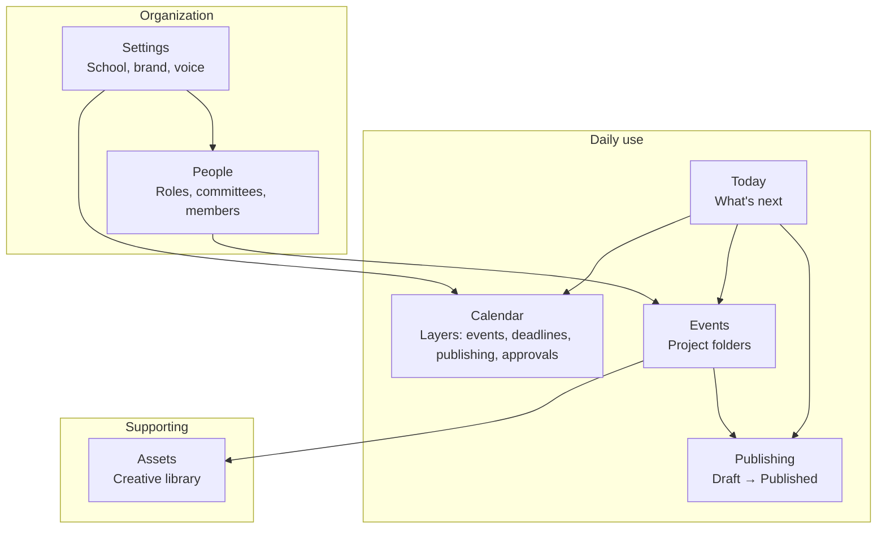

# CampaignOS 2.0 — Navigation Experience Redesign

**Purpose:** Blueprint for simplifying navigation so CampaignOS feels like a calm communications assistant — not a collection of engines and tabs.  
**Status:** Product blueprint — documentation only  
**Last updated:** June 2026  
**Philosophy:** `16_CAMPAIGNOS_EXPERIENCE_PHILOSOPHY.md`  
**Organization model:** Engine 7.1 Organization Workspace (`/settings/organization`); onboarding Steps 3–5 in `15_ORGANIZATION_ONBOARDING.md`

> **Note:** `14_ORGANIZATION_WORKSPACE.md` does not exist yet. Organization Workspace behavior is documented in onboarding Step 3–5 and implemented at `/settings/organization`.

---

## Problem

Current navigation grew with each engine:

- **Dashboard** sounds like analytics software
- **Calendar** uses internal tabs: Planning · Events · Review Imports · Publishing
- **School Setup** vs **Settings** vs **Organization Workspace** overlap conceptually
- **Create Event** is a top-level nav item (action, not a place)
- Volunteers think in *today, calendar, events, people* — not *planning, review imports, command center*

---

## Future main navigation

| Nav item | One-line purpose |
|----------|------------------|
| **Today** | What should I do next? |
| **Calendar** | See the whole year — events and work together |
| **Events** | Open any event’s project folder |
| **Publishing** | Drafts, ready, scheduled, published |
| **Assets** | Logos, flyers, photos, inspiration |
| **People** | How your PTO works — roles, responsibilities, committees |
| **Settings** | School, brand, voice, integrations, account |

**Removed from primary nav (absorbed elsewhere):**

- Dashboard → **Today**
- School Setup → **Settings** (first-run onboarding flow)
- Create Event → button on **Today** and **Events**
- Calendar sub-tabs → **Calendar layer toggles**
- Settings → Organization Workspace → **People**

---

## Section definitions

### Today

**Replaces Dashboard eventually.** The emotional home of CampaignOS.

**Shows:**

| Block | Content |
|-------|---------|
| **What's next** | Single highest-priority action |
| **Waiting on me** | Drafts to finish, approvals to give, posts to schedule |
| **Waiting on others** | “Rebecca still needs to approve the flyer.” |
| **This week** | Events + communication due dates in plain language |
| **You're caught up** | Calm empty state when nothing needs attention |

**Route:** `/today` (future) — **`/dashboard` redirects** during transition.

**Does not show:** Communication Health percentages as the hero metric (supporting detail at most).

---

### Calendar

**One unified calendar** for the school year.

**Layer toggles** (replace long-term tab model):

| Layer | Shows |
|-------|-------|
| Events | School & PTO events |
| Communication deadlines | What needs to be written, reviewed, or posted |
| Publishing | Scheduled and ready-to-go content |
| Approvals | Waiting on someone |
| Volunteer tasks | Signups, shifts, committee asks (future) |

**Interaction:** Same month/week/agenda views; layers filter what appears — not separate “Planning” vs “Events” mental models.

**Route:** `/calendar` (keep). Remove tab strip long-term; keep layers in a single toolbar.

---

### Events

Event workspaces / projects — Book Fair, Teacher Appreciation, Spirit Night, etc.

**Route:** `/events` (list), `/events/[id]` (workspace), `/events/create` (action, not nav).

---

### Publishing

Queue / outbox for all channels.

**Columns or filters:**

- Drafts
- Ready
- Scheduled
- Published

**Route:** `/publishing` (future). Today: **`/calendar?tab=publishing`** and event workspace publishing sections.

---

### Assets

Creative library — logos, flyers, photos, Canva exports, past inspiration.

**Route:** `/assets` (future). Today: scattered across **School Setup** brand upload, **Event Workspace** creative assets, storage buckets.

---

### People

Organization workspace — how the PTO operates.

**Includes:**

- Organization roles (system + custom)
- Members (manual, no auth in current sprint)
- Responsibility matrix (who handles Facebook, newsletter, etc.)
- Committee ownership (Book Fair → owner, how much comms, playbook)

**Route:** `/people` (future). Today: **`/settings/organization`**.

Onboarding Steps 3–5 reuse the same section components with warmer intro copy.

---

### Settings

Infrequent configuration:

- School identity
- Brand
- Organization voice (AI Brain inputs)
- Playbooks (until fully automated from committees)
- Integrations & account (future)

**Route:** `/settings`, `/settings/ai-brain`, `/settings/playbooks`.

---

## Current → future route map

| Current route | Future home | Notes |
|---------------|-------------|-------|
| `/` | → `/today` | Redirect today: `/dashboard` |
| `/dashboard` | **Today** | Rename UX only first; route alias |
| `/calendar` | **Calendar** | Default view = unified; layers replace tabs |
| `/calendar?tab=planning` | **Calendar** (Communication deadlines layer) | “Planning” label retired |
| `/calendar?tab=events` | **Calendar** (Events layer) | Merged into one calendar |
| `/calendar?tab=review` | **Calendar** or **Settings → Import calendar** | Review imports is setup, not daily nav |
| `/calendar?tab=publishing` | **Publishing** | Moves to `/publishing` |
| `/communications/calendar` | **Calendar** | Already redirects to `/calendar?tab=planning` |
| `/calendar/review` | **Settings** or onboarding Step 8 | Legacy direct link |
| `/events` | **Events** | Unchanged |
| `/events/create` | **Events** (action) | Remove from sidebar |
| `/events/[id]` | **Events** (workspace) | Unchanged |
| `/school-setup` | **Settings** + onboarding | First-run wizard |
| `/settings` | **Settings** | Unchanged |
| `/settings/organization` | **People** | `/people` alias later |
| `/settings/ai-brain` | **Settings → Voice** | Softer label |
| `/settings/playbooks` | **Settings → Playbooks** | May fade as defaults improve |

---

## Sidebar evolution

### Current (Release 0.5)

```
Dashboard
School Setup
Calendar
Events
Create Event
Settings
```

### Target

```
Today
Calendar
Events
Publishing
Assets
People
Settings
```

**Transition rules (Engine 7.15+):**

1. Rename Dashboard → Today in copy; keep `/dashboard` href
2. Remove Create Event from sidebar; keep button on Today / Events
3. Add Publishing when queue is real enough to stand alone
4. Add Assets when library UI exists
5. Add People linking to `/settings/organization` until `/people` ships
6. Move School Setup out of daily nav into Settings + onboarding

---

## Calendar tab → layer migration

| Current tab | Future layer | Copy change |
|-------------|--------------|-------------|
| Planning | Communication deadlines | “What’s due” |
| Events | Events | Same |
| Review Imports | (out of daily calendar) | “Review your uploaded calendar” in Settings/onboarding |
| Publishing | Publishing layer | Same; also top-level **Publishing** nav |

**Interim (this sprint):** Tab labels and hero copy soften — “Planning” → “What’s due”; remove “Calendar Command Center” eyebrow.

---

## Information architecture diagram



---

## Copy alignment checklist

When implementing navigation changes, verify each item against `16_CAMPAIGNOS_EXPERIENCE_PHILOSOPHY.md`:

- [ ] No “Command Center,” “Planning,” or “Engine” in primary nav
- [ ] Today answers “What should I do next?”
- [ ] Empty states feel supportive, not accusatory
- [ ] People replaces “Organization Workspace” in nav label
- [ ] Settings stays boring and rare

---

## Recommended next implementation sprint

### Engine 7.15 — Today Experience

**Goal:** Turn Dashboard into **Today** — the friend-like home screen.

**Scope:**

| Feature | Description |
|---------|-------------|
| Rename & reframe | Page title “Today”; hero “Here’s what needs your attention.” |
| What's next | Top priority card from real data (due today / overdue) |
| Waiting on me | Communication steps + drafts assigned to current user placeholder |
| Waiting on others | Approval placeholders with person names when available |
| This week | Events + deadlines merged list |
| Caught up state | Warm empty state when all clear |
| Sidebar | Label “Today”; optional `/today` alias → `/dashboard` |

**Out of scope for 7.15:**

- Full nav rebuild (Publishing, Assets, People routes)
- Calendar layer toggle refactor
- Auth / real assignee resolution

**Exit criteria:**

- Jamie opens the app and immediately sees one clear next action or a calm “You’re caught up”
- No “Communication Health” as the dominant hero metric
- `npm run lint` + manual verification on `/dashboard`

---

## Document history

| Date | Change |
|------|--------|
| June 2026 | Initial blueprint — Experience Reset sprint (docs + copy polish) |
