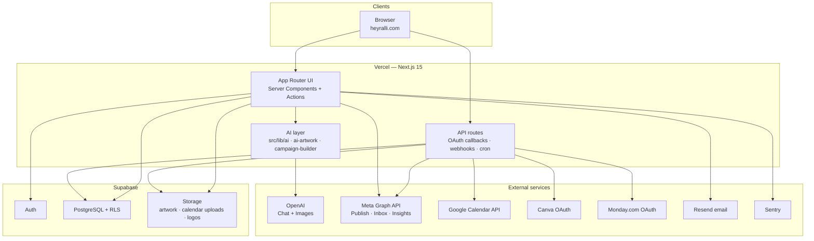
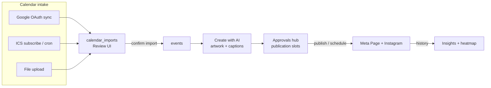

# Hey Ralli — Architecture Overview for QA

**Audience:** QA engineers reviewing the application  
**Product brand:** Hey Ralli (codebase / deploy project may still say CampaignOS)  
**Production:** [heyralli.com](https://heyralli.com)  
**Last updated:** July 22, 2026  

This document is a short orientation guide: what the product does, how it is built, how the main AI → publish path works, how systems connect, and what is still incomplete.

Related detail: [architecture.md](../engineering/architecture.md) (engineering structure), [Ask Ralli Assistant](../engineering/ask-ralli-assistant.md) (coach routing + QA matrix; Playwright `tests/hey-ralli/smoke/12-ask-ralli-assistant.spec.ts`), [feature-list.md](../product/feature-list.md), [meta.md](../integrations/meta.md), [google-calendar.md](../integrations/google-calendar.md).

---

## 1. What Hey Ralli does

Hey Ralli is an AI communications operating system for school PTO / PTA volunteers. New orgs start value-first (Welcome → create a first event → optional calendar / brand / team prompts, with a Get started checklist for anything skipped). From there it turns a school calendar into planned social campaigns: import dates (Google Calendar, ICS subscribe, or file upload), organize them as events, generate on-brand artwork and captions with AI, route posts through board approval, and publish or schedule to Facebook and Instagram via a connected Meta Page. Volunteers also get a Today dashboard, tasks, a Meta inbox with AI reply drafts, Insights, and team access controls — so communications stay calendar-first, human-approved, and in one place instead of scattered across Canva, Docs, and Facebook.

---

## 2. Tech stack

| Layer | Technology | Notes for QA |
|-------|------------|--------------|
| App framework | **Next.js 15** (App Router) + **React 19** | Server Components for data load; Server Actions for writes |
| Language | **TypeScript** | Strict typing across `src/` |
| UI | **Tailwind CSS 4** + shared `src/components/ui` | Design tokens (`cos-*` classes) |
| Auth & database | **Supabase** (Auth, PostgreSQL, Storage, RLS) | Org membership + RLS scopes data; service role used by some cron jobs |
| Hosting | **Vercel** | Production + Preview; env vars per environment |
| AI (text) | **OpenAI** Chat Completions (`OPENAI_API_KEY`) | Captions, calendar fix-up, inbox drafts, Ask Ralli, campaign copy |
| AI (images) | **OpenAI Images** API | Feed (1:1) + Story (9:16) artwork |
| Social publish / inbox / insights | **Meta Graph API** | Org OAuth → `organization_meta_connections` |
| Calendar OAuth | **Google Calendar API** | Org OAuth → `organization_google_calendar_connections` |
| Email | **Resend** | Invites / welcome magic links (config-dependent) |
| Error monitoring | **Sentry** (`@sentry/nextjs`) | “Report a problem” + server/client capture |
| Optional integrations | **Canva**, **Monday.com** | OAuth; not required for core publish path |
| E2E smoke | **Playwright** (`tests/hey-ralli/smoke/`) | e.g. Tasks, Insights, Ask Ralli (`12-ask-ralli-assistant`) |

**Typical request shape**

1. Browser hits a dashboard route under `src/app/(dashboard)/…`
2. Server Component loads data via `src/lib/*/queries.ts` (Supabase user session)
3. User action → Server Action in `src/lib/*/actions.ts` → mutations → `revalidatePath`
4. Background work: Vercel Cron → `/api/cron/*` (publish due posts, inbox sync, calendar sync, token health)

**Environments QA should distinguish**

- **Local:** `.env.local` (OpenAI, Supabase, Meta, Google, etc.)
- **Preview / Production:** Vercel env; OAuth redirect URIs must match the host
- **Meta / Google OAuth in Testing mode:** only allowlisted test users can complete Connect

---

## 3. AI workflow — event upload to published post

Happy path for QA (calendar-first → Create with AI → Approvals → Meta).

```
Calendar import → Review → Events on Calendar
       ↓
Pick / open Event → Create with AI (campaign)
       ↓
AI artwork + captions per milestone
       ↓
Send to Approvals → Approve / request changes
       ↓
Schedule or Publish now → Meta (Facebook Page + Instagram)
       ↓
Appears on Calendar / Approvals “published” · feeds Insights & heatmap history
```

### Step-by-step

| Step | What the user does | What the system does | Where to test |
|------|--------------------|----------------------|---------------|
| **1. Value-first onboarding** | Welcome → create first event → skippable Calendar / Brand / Team overlay (or finish later from Get started) | Bootstraps org + school year; persists progress on `organizations.onboarding_state`; brand at `/onboarding/brand` | `/onboarding` → event `?onboarding=…`; checklist: Settings → **Get started** (`/settings/school-setup`) |
| **2. Connect Meta** (required to publish) | Settings → Meta → Connect | OAuth → stores Page + tokens on `organization_meta_connections` | `/settings/meta` |
| **3. Import calendar** | Sign in with Google, ICS subscribe URL, or upload file (same screen as onboarding calendar CTA) | Parses / syncs into `calendar_imports` → review | Canonical: `/calendar/import` → `/calendar/review`; connect/manage: `/settings/integrations/calendar` |
| **4. Review dates** | Edit categories / strategies; confirm import | Inserts rows into `events` (view-only school dates) | `/calendar/review` |
| **5. See the year** | Open Calendar (month / week / agenda) | Reads `events` + scheduled Meta slots; week view may show posting heatmap if Meta connected | `/calendar` |
| **6. Open an event** | Events list or Calendar → event workspace | Loads event + tabs (Create with AI, Approvals, Tasks, …) | `/events/[id]` |
| **7. Create with AI** | 4 steps: Creative Setup → Milestones → Preview → Review & Approve; generate artwork + captions | OpenAI text + image APIs; assets in Supabase Storage | `/create-with-ai` or event **Create with AI** |
| **8. Human edit** | Regenerate, edit caption, adjust artwork | AI is assistive — nothing posts without later approval/publish | Campaign builder Preview / Review |
| **9. Send to Approvals** | Send for approval from Review | Creates / updates `approval_scheduling_items`; **Sent for approval** notice then back to Review tabs (Pending Review pills) | Campaign builder `#review` / notice; `/approvals` |
| **10. Approve** | Approver accepts or requests changes | Status gates publishing; session sync moves Review pills to Approved / Changes requested | `/approvals` |
| **11. Publish or schedule** | Publish now or set schedule | Graph API publish (or cron picks up due scheduled slots) | Approvals / publish actions |
| **12. After publish** | Optional: check Inbox, Insights, Calendar | Inbox sync, Insights metrics, heatmap uses published timestamps | `/inbox`, `/insights`, `/calendar` (week) |

### Other AI touchpoints (not on the main publish path)

- **Calendar AI fix** — improve parsed dates/titles during import review  
- **Inbox AI drafts** — suggest replies; approve-then-send to Meta  
- **Ask Ralli** — in-app assistant widget  
- **Tasks AI suggestions** — optional task ideas  
- **AI Brain** — org voice / style prefs that influence generation tone  

**Principle for QA:** AI drafts; humans approve and publish. There is no silent auto-post of campaign creative without the Approvals / publish path.

---

## 4. System architecture diagram

### High-level systems



### Core domain flow (calendar → publish)



### Multi-tenant model (QA implication)

- Users belong to one or more **organizations** via memberships.  
- Almost all product data is **organization-scoped** (enforced in app queries + Postgres RLS).  
- Integrations (Meta, Google Calendar, Canva, Monday) are stored **per organization**, not per user.  
- Switching org (when the user has multiple) changes which calendar, Meta Page, and campaigns you see.

### Background jobs (Vercel Cron)

| Job (approx.) | Purpose |
|---------------|---------|
| Calendar ICS subscribe sync | Auto-import new feed events |
| Google Calendar sync | Auto-import new Google events (connected orgs) |
| Meta publish | Publish due scheduled slots |
| Meta token health | Detect expired / unhealthy connections |
| Inbox sync | Pull Meta DMs / comments / mentions |
| Story / manual-upload reminders | Reminder emails for manual upload flows |

---

## 5. Known limitations and work in progress

Use this as a **do-not-file-as-regression** / expected-gap list unless the ticket says otherwise. Source of truth for status: [feature-list.md](../product/feature-list.md).

### Incomplete or stub

| Area | Status | QA note |
|------|--------|---------|
| Create with AI → full Meta slot sync after approval | **Stub / incomplete** | Send → Approvals → schedule/publish works; deep Meta “published state” sync polish may be incomplete |
| Stripe / real billing checkout | **Deferred** | Pricing page is marketing; paid plan gates not enforced |
| Gmail inbox + Gmail OAuth | **Deferred** | Meta inbox only for now |
| Insights demographics / LLM narrative | **Deferred** | KPIs + rule-based recommendations shipped |
| Insights-weighted posting heatmap | **Deferred** | Heatmap uses preferred windows + local publish times when Meta is connected |
| Tasks Calendar / Timeline / Workload tabs | **Deferred** | Hidden in UI |
| Vendor payments / contracts depth | **Partial** | Directory + profile shipped; deep tabs are shells |
| AI credits widget | **Stub** | Placeholder UI |
| 2FA | **Deferred** | |
| Shared connection-health framework polish | **Partial** | Per-provider Connect works; unified health contract still evolving |

### Behavioral / product constraints

1. **Human-in-the-loop** — Campaign posts require Approvals / explicit publish; AI does not auto-publish creative.  
2. **Calendar review-first (manual import / Google first sync)** — Dates appear on `/calendar` after review confirm (daily Google/ICS cron may auto-import new deduped events).  
3. **Meta required for publish, Inbox, Insights, heatmap toggle** — Without org Meta Connect, those surfaces empty or hide Meta-backed UI.  
4. **Google / Meta OAuth “Testing”** — Only listed test users can Connect until apps are published / verified.  
5. **Google Calendar = primary calendar** — No multi-calendar picker yet.  
6. **Posting heatmap ≠ Meta Insights engagement** — Scores are prefs + when you published, not reach/engagement heat.  
7. **Canva / Monday / OpenAI** — Features no-op or show “not configured” without env credentials.  
8. **Legacy surfaces** — Old Creative Studio / Publishing Center redirect; prefer Create with AI + Approvals.  
9. **Role permissions** — Artwork, approve, publish, people, integrations are gated; test with more than one role when validating access.  
10. **Founding access / invites** — Sign-up may require access code; invite links set password via `/invite/[token]`.

### Suggested QA focus areas (high value)

1. **Happy path:** Calendar import → review → Create with AI → Approvals → schedule/publish (Meta connected).  
2. **Integrations:** Meta Connect/reconnect; Google Calendar Connect + sync → review; expired-token messaging.  
3. **Permissions:** Viewer vs Chair vs Owner on approve/publish/artwork.  
4. **Empty / error states:** No Meta, no school year, AI key missing, OAuth cancel.  
5. **Regression smokes:** `npm run test:hey-ralli` (Playwright); unit suites under `src/lib/**/__tests__` as needed.

### Doc map for deeper review

| Topic | Doc |
|-------|-----|
| Engineering architecture | [architecture.md](../engineering/architecture.md) |
| Ask Ralli Assistant | [ask-ralli-assistant.md](../engineering/ask-ralli-assistant.md) |
| Full feature status | [feature-list.md](../product/feature-list.md) |
| Meta Connect model | [meta.md](../integrations/meta.md) |
| Meta Calendar DnD / native schedule | [meta-calendar-dnd.md](./meta-calendar-dnd.md) |
| Google Calendar | [google-calendar.md](../integrations/google-calendar.md) |
| School calendar import dedupe | [calendar-import-dedupe.md](./calendar-import-dedupe.md) |
| Access control phases | [access-control.md](../engineering/access-control.md) |
| Storage / RLS notes | [storage-rls.md](../engineering/storage-rls.md) |

---

*End of QA architecture overview. Treat [feature-list.md](../product/feature-list.md) + this doc as current product truth; `docs/archive/RELEASE_0_5` / `SPRINTS` are historical.*

---

**Canonical docs:** [Documentation home](../README.md) · [Feature list](../product/feature-list.md) · [Architecture](../engineering/architecture.md)
