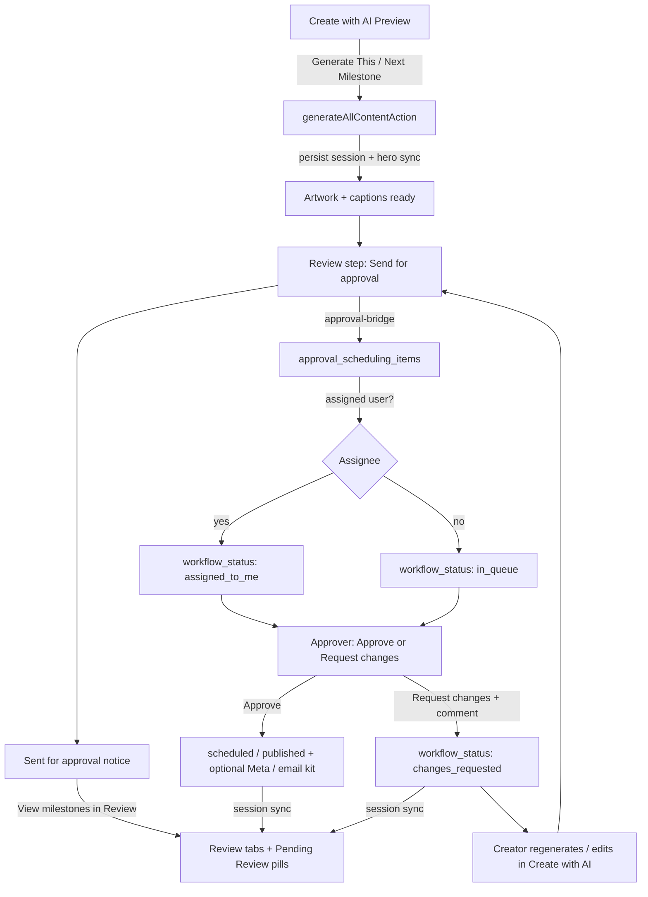

# Artwork generation → request changes / re-approval — findings

**Scope:** Create with AI (Campaign Builder V2) artwork generation, Approvals & Scheduling hub, notifications, and sidebar badges.  
**Sources:** Code map (2026-07-18) + Playwright `tests/hey-ralli/smoke/09-artwork-generation-approval.spec.ts`  
**Runtime observations:** `test-results/hey-ralli/artwork-generation-approval-observations.md` (written when the smoke runs)

---

## 1. Workflow steps (how changes go)

Create with AI is a **4-step** stepper (Creative Setup → Milestones → Preview → Review & Approve). After send, a **Sent for approval** notice appears (`#published` hash — not a numbered step); primary CTA returns to Review with the **Needs review** tab.

### Review tabs (approval lifecycle)

| Tab | Milestone `generationStatus` | Row pill |
|-----|------------------------------|----------|
| All Milestones | any with preview | Ready to send / Pending Review / Approved / Changes requested / Incomplete |
| Needs review | `awaiting_approval` | **Pending Review** |
| Approved | `approved` · `scheduled` · `published` | **Approved** |
| Changes requested | `changes_requested` | **Changes requested** |

Hub outcomes sync back into the campaign session (`sync-session-from-scheduling.ts` + load heal) so milestones move between tabs after Approvals actions.

### Generate artwork (does **not** create an approval row by itself)

1. User opens `/events/{id}/campaign-builder` → Preview (`#preview`).
2. UI calls `generateMilestoneContent` → server `generateAllContentAction` (**exactly one** milestone).
3. Feed then story artwork (+ captions) run sequentially — commonly **3–8 minutes**.
4. On success the action:
   - Returns artwork/caption results
   - **Persists** into `campaign_builder_sessions` (`applyGenerationResultsToSession`) so Safari/navigation cannot lose URLs
   - Syncs hero artwork via `syncHeroFromMilestoneArtwork` (no layout revalidate during generate)
5. Client status labels (`MILESTONE_STATUS_LABELS`): e.g. `generating` → **In progress**, then **Complete** / needs-review derived states.

### Send for approval (creates / updates scheduling items)

`sendForApprovalAction` → `sendCampaignBuilderForApproval` (`approval-bridge.ts`):

- Only milestones with **real artwork** are submitted (caption-only skipped).
- Upserts `approval_scheduling_items` with snapshot (feed/story URLs, captions, schedule, delivery method).
- Initial `workflow_status`:
  - `assigned_to_me` if org/event approval assignee resolves to a user
  - else `in_queue`
- Client sets submitted milestones to `generationStatus: "awaiting_approval"` (Review pill **Pending Review**) and navigates to the **Sent for approval** notice (`#published` — not a stepper step).
- **Resubmit / re-approval** when an existing row is in `in_queue` | `assigned_to_me` | `changes_requested`: full row refresh + status reset to assignee-based pending status, `notes`/`resolved_at` cleared, `requested_at` bumped.
- If row is already `scheduled` / `posted` / `published`: status is kept; display snapshot (artwork/caption) may still refresh.

### Request changes

Approvals hub → Review drawer → **Request changes** (comment required):

- Client: `requestUnifiedChangesAction`
- Scheduling path: `workflow_status` → `changes_requested`, stores comment in `notes`, sets `resolved_at`
- Classic communication path (if `communicationItemId`): `requestCommunicationChanges` → item `pending_approval` → `changes_requested`; approval_request resolved as `rejected`
- **Approve is blocked** on classic `changes_requested` until resubmit (“Resubmit it for approval after edits”)

### Re-approval (after edits)

1. Creator edits / regenerates in Create with AI (`#review` CTA email points here).
2. Creator **Send for approval** again → bridge resubmitStatuses include `changes_requested` → back to `in_queue` / `assigned_to_me`.
3. Approver can Approve again (may schedule Meta feed / send manual upload kit — smoke tests must not click Approve carelessly).

---

## 2. How the user is notified

| Event | Channel | Implementation |
|-------|---------|----------------|
| Sent for approval | **Email** to assignee (if email resolved) | `sendApprovalAssignedEmail` → Resend via `sendEmail`; CTA `/approvals?event=` |
| Changes requested | **Email** to creator (`requested_by_user_id`) | `sendChangeRequestedEmail`; CTA Create with AI `#review` |
| Content approved | **Email** to creator | `sendContentApprovedEmail` |
| Scheduled / manual kit | **Email** | `sendScheduledDeliveryEmail` / `sendCampaignManualUploadEmail` |
| All of the above | **Audit log** | `approval_notification_log` (`sent` / `failed` / `skipped`) |
| Approvals UI errors | **In-app toast** | `CalendarActionToast` on hub (`actionError`) |
| Activity | Activity log (classic path) | `activity_log` “Changes requested” / “Draft approved” |

**Not wired as primary:** dedicated in-app inbox rows for approval assign/change-request (Inbox unread is a separate product surface). Guide copy on Approvals says “You’ll get a notification” — today that means **email** when `RESEND_API_KEY` is set; otherwise logged/skipped only.

---

## 3. How re-approval is determined

| Layer | Rule |
|-------|------|
| Permissions | Act on Approvals: EffectiveAccess **`approve_comms`** (hub `canViewAll` / `canActOnUnifiedItem`). Non-approvers only if `assignedToMe`. Unassigned `in_queue` campaign-builder rows: non-approvers **cannot** act until assigned. |
| Create / upload | Inspiration upload + AI artwork actions gated by **`upload_artwork`** (separate from approve). |
| Submit for approval | Creator flow; no `approve_comms` required to send. |
| Request changes | Comment required; scheduling → `changes_requested`; classic only from `pending_approval`. |
| Re-enter queue | Resend for approval while status ∈ `{in_queue, assigned_to_me, changes_requested}`. |
| Approve after changes | Must leave `changes_requested` via resubmit first (classic explicitly; scheduling via resubmit status reset). |

---

## 4. Badges (sidebar / Approvals hub)

### Sidebar (every dashboard layout)

`layout.tsx` merges:

1. **Scheduling lean counts** — `getSidebarSchedulingBadgeCounts()`
   - Pending (red): head-count `workflow_status ∈ {assigned_to_me, in_queue}` (approvers: all scoped events; others: assigned to them)
   - Change requests (amber): head-count `workflow_status = changes_requested` **and** `requested_by_user_id = current user` (creator’s “sent back” cue)
2. **Classic lean counts** — `getApprovalSidebarCountsForCurrentUser()` on `approval_requests`
3. Display: `Math.max(classic, scheduling)` for each badge type

Rendered on **Approvals** nav via `NavNotificationBadge`:

- Approval: `{n} approval(s) waiting`
- Change request: `{n} change request(s) for you`

### Approvals hub

- Summary cards / tabs: In queue, Assigned to me, Scheduled, Posted, Published, **Changes requested** (`summarizeCounts`)
- Table status badges + Review drawer actions when `canActOnUnifiedItem`

Stability P0: sidebar uses `{ count: "exact", head: true }` — not full row materialization.

---

## 5. Permissions cheat sheet

| Capability | Permission | Typical roles (templates) |
|------------|------------|---------------------------|
| Generate / upload inspiration & artwork | `upload_artwork` | Admin, creative seats |
| Approve / request changes / reassign | `approve_comms` | Admin, president, VP comms, etc. |
| Comment on change-request thread (classic) | `submit_approval` (+ submitter or admin) | Creators |

---

## 6. Playwright smoke

| Item | Value |
|------|--------|
| Spec | `tests/hey-ralli/smoke/09-artwork-generation-approval.spec.ts` |
| Run | `./scripts/hey-ralli-test.sh tests/hey-ralli/smoke/09-artwork-generation-approval.spec.ts` |
| Env | `HEY_RALLI_TEST_EMAIL` / `PASSWORD` / `EVENT_ID` (optional `BASE_URL`) |
| Skip AI | `HEY_RALLI_SKIP_ARTWORK_GENERATION=true` |
| Mutate request-changes | `HEY_RALLI_EXERCISE_REQUEST_CHANGES=true` (default: observe UI only) |
| Timeout | Spec ~12 min; generation wait up to 10 min |
| Safety | Does **not** click Approve (avoids Meta/manual kit). **Does** click Send for approval after generate so Approvals rows exist. Request-changes submit remains opt-in. |

### Gaps / flakiness notes

- Live generation depends on AI providers + event Inspiration completeness; 3–8+ min is normal.
- If all milestones already Complete, Part 1 skips re-generation to avoid overwriting staging art.
- Request-changes exercise is opt-in to avoid mutating shared staging queues.
- Sidebar change-request badge counts **submitter** rows — an approver who requests changes may not see that badge increase on their own nav.
- Email delivery cannot be asserted in Playwright without mailbox access; code path logs to `approval_notification_log`.

---

## 7. Runtime results

See also `test-results/hey-ralli/hey-ralli-report.txt` (and observations markdown when written by the smoke).

### 2026-07-20 (4-step builder + approval-aware Review)

| Check | Result | Notes |
|-------|--------|-------|
| Spec `09` | **PASS** (~23s this run) | Staging artwork already present; send + Approvals observe path |
| Spec `05` | **PASS** | Approvals routing + badges + calendar intact |
| Send for approval | **success** | Expect **Sent for approval** notice (`#published`); not a stepper step |
| Approvals drawer | **PASS** | Soft-skip when row already Approved/scheduled (do not match disabled “Approved” as act buttons) |
| Approve | **not clicked** | Avoids Meta / manual kit side effects |

### 2026-07-18 (prior)

| Check | Result | Notes |
|-------|--------|-------|
| Spec `09` | **PASS** (~3.3 min) | Real regenerate via Edit artwork → Regenerate artwork |
| Generation wait | **success** | Feed+story regenerate completed under 10 min |
| Send for approval | **success** | Navigated to post-send confirmation |
| Approvals summary cards | **visible** | Including Changes requested |
| Sidebar pending badge | **visible** | `{n} approvals waiting` |
| Sidebar change-request badge | not shown | Count 0 for this user (creator-scoped) |
| Review drawer / Request changes | **observed** | Submit opt-in via `HEY_RALLI_EXERCISE_REQUEST_CHANGES=true` |

### Product insight from the run

Staging event **Stock the Fridge** often already has complete artwork. Smoke regenerates via the Edit artwork modal when needed. Approvals hub defaults to **Assigned to Me**; smoke switches to **All**. Resubmit after Send for approval refreshes pending rows when status ∈ `{in_queue, assigned_to_me, changes_requested}`. Create with AI Review tabs track approval lifecycle after send (Pending Review → Approved / Changes requested).
