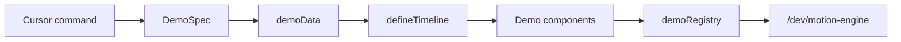

# Hey Ralli Marketing Demo Generator

**Status:** Living  
**Owner:** Engineering  
**Last updated:** 2026-07-23

Developer-facing **command → DemoSpec → demo** contract for Cursor.

## What this is

A reusable authoring system so future animated marketing demos are consistent:

short Cursor command → typed DemoSpec → static data → timeline → components → private harness → validation

## What this is not

- Not a visual editor
- Not a public AI prompt box on the website
- Not a marketing page builder
- Not a second animation engine
- Not a scaffolding CLI dependency

## Related systems

| Path | Role |
|------|------|
| [`../engine/`](../engine/) | Motion Engine (clock, primitives) |
| [`../demos/CreateAI/`](../demos/CreateAI/) | Reference demo |
| [`./demoRegistry.ts`](./demoRegistry.ts) | Private harness registration |
| [`./authoring/CURSOR_DEMO_COMMAND.md`](./authoring/CURSOR_DEMO_COMMAND.md) | **Pasteable Cursor commands** |

## How commands become demos



1. Author pastes a detailed or short command ([CURSOR_DEMO_COMMAND.md](./authoring/CURSOR_DEMO_COMMAND.md)).
2. Cursor reads this README + engine README + CreateAI reference.
3. Cursor writes `defineDemoSpec(...)` **first**.
4. Then data, timeline, components, registry entry.
5. Preview privately. Stop before public integration.

## Folder contract

```
src/marketing/demos/[DemoName]/
  [DemoName]Demo.tsx
  [demoName]Spec.ts
  [demoName]Timeline.ts
  demoData.ts
  index.ts
  README.md
  components/   # only what is needed
```

Helpers: `deriveDemoNames()`, `demoFolderContract()`, templates in `./templates/`.

## DemoSpec

Create with:

```ts
import { defineDemoSpec } from "@/marketing/demo-generator";

export const MY_SPEC = defineDemoSpec({
  id: "volunteer-intelligence",
  name: "Volunteer Intelligence",
  folderName: "VolunteerIntelligence",
  previewLabel: "Volunteer Intelligence",
  // ...
});
```

Required highlights:

- `playback.duration`, `loop`, `autoplay`
- `states.startingState` / `finalState` / `reducedMotionState`
- `beats[]` with unique kebab-case ids and valid timing
- `responsive.primaryStory`
- `goal`, `productArea`, `previewLabel`

Validation rejects: missing ids, duplicate beat ids, negative timing, end ≤ start, beats past duration, missing reduced-motion state, empty goal, invalid id/folder names. Overlaps error unless `playback.allowBeatOverlap` or `beat.overlapOk`.

## Registry

Register in [`demoRegistry.ts`](./demoRegistry.ts):

```ts
{
  id: "volunteer-intelligence",
  label: "Volunteer Intelligence",
  description: "…",
  specId: "volunteer-intelligence",
  Demo: lazyDemo(() => import("@/marketing/demos/VolunteerIntelligence"), {
    loading: () => DemoLoadingFallback(),
    ssr: false,
  }),
}
```

The harness lists demos from this registry automatically.

## Harness

- URL: `/dev/motion-engine`
- Tabs: **Marketing demos** (registry selector) · **Engine primitives**
- Production: `notFound()` when `NODE_ENV === "production"`
- Never linked from public navigation

## Default design rules

Warm cream backgrounds, white surfaces, thin borders, charcoal text, soft sage, mustard sparingly, calm shadows, restrained motion, product UI as focus, static realistic content.

Avoid: purple SaaS gradients, neon, heavy glow/glass, bounce spam, preschool clip art, cartoon people, fake analytics/testimonials, remote image APIs, runtime artwork generation.

## Default timing rules

- Most demos: **18–28 seconds**
- Initial hold: **2–3s**
- Actions: **1–3s**
- Major reveal: **2–4s**
- Final hold: **≥2s**
- Prefer **≤7 major beats**
- Prefer clarity over speed or completeness

## Reduced-motion contract

Every spec must describe `states.reducedMotionState`. Runtime demos must jump to the informative completed state — no cursor travel, typing, pulse, shimmer, confetti, or large slides.

## Validation expectations

Typecheck, lint, tests, production build, normal + reduced motion, desktop/tablet/mobile, offscreen + hidden-tab pause, loop stability, a11y, zero network/backend/dashboard imports.

## Creating from a detailed command

Paste the detailed block in [CURSOR_DEMO_COMMAND.md](./authoring/CURSOR_DEMO_COMMAND.md) and follow [DEMO_BUILD_CHECKLIST.md](./authoring/DEMO_BUILD_CHECKLIST.md).

## Creating from a short request

Paste the short natural-language form. Cursor must expand to a full DemoSpec before implementation.

## Public integration

Demos stay private until an intentional marketing-page PR. Use [DEMO_REVIEW_CHECKLIST.md](./authoring/DEMO_REVIEW_CHECKLIST.md) first.
